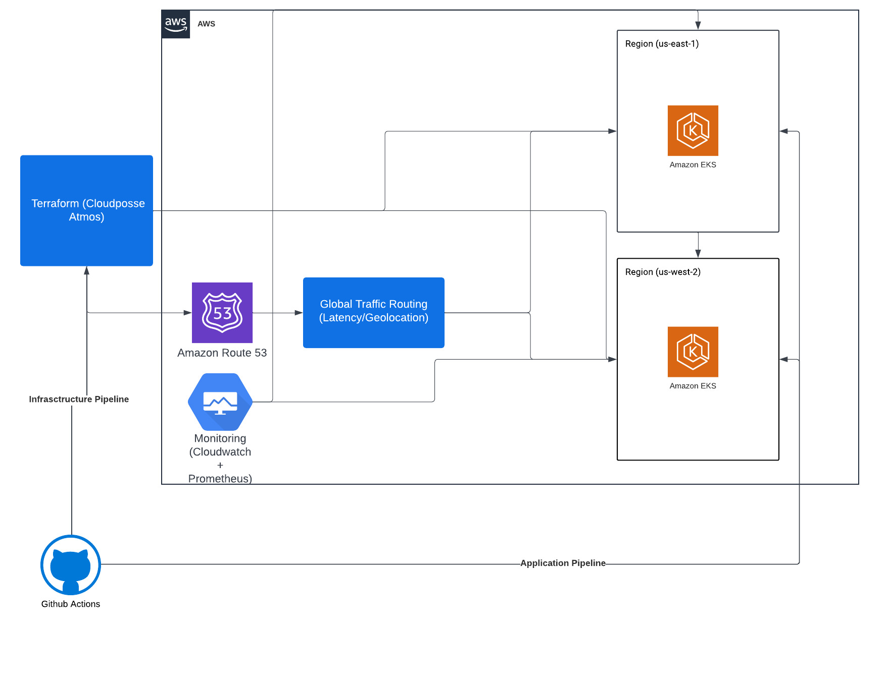

## Overview
The Objective of this article is to create an architechture with the following objectives:
- High availability across global regions with multi-region AWS EKS architecture.
- Automated deployment using Terraform for consistent, scalable infrastructure.
- CI/CD pipeline for automated microservices deployment across AWS regions.
- Intelligent traffic routing using AWS Route 53 with latency/geolocation policies.
- Automated failover and cost optimization.

## Architecture


## IAC - Terraform with cloudposse atmos

#### How It Works

1. **Create an EKS Component**: This component will contain the Terraform module for EKS. For this example, we’ll use `terraform-aws-modules/eks/aws`.

2. **Create `main.tf` with Parameters**:
   - Create the file in the directory `components/terraform/eks`.
   - Define the EKS module:

   ```hcl
   module "eks_cluster" {
     source  = "terraform-aws-modules/eks/aws"
     version = "~> 19.0"
     
     # Cluster configuration
     cluster_name    = var.cluster_name
     cluster_version = var.cluster_version
     # ……
   }

3. **Create bastion.tf to create bastion hosts to access the cluster**
   ```hcl
   module "ec2_bastion" {
    for_each = local.public_subnet_ids
    source = "cloudposse/ec2-bastion-server/aws"

    enabled = module.this.enabled

    instance_type               = var.instance_type
    security_groups             = compact(concat([module.vpc.outputs.vpc_default_security_group_id], var.security_groups))
    subnets                     = each.value
    key_name                    = var.key_name
    user_data                   = var.user_data
    vpc_id                      = local.vpc_id
    associate_public_ip_address = var.associate_public_ip_address

    context = module.this.context
   }

4. **Create remote-state.tf to import the vpc deployed through vpc component**
    ```hcl
    module "vpc" {
        source = "cloudposse/stack-config/yaml//modules/remote-state"
        version = "1.5.0"
        component = var.vpc_component_name
        atmos_base_path = "../../../"
        context = module.this.context
    }

5. **Create variables.tf , outputs.tf accordingl to the tf modules**
6. **Create a dir stacks/catalog/eks (catalog calls all the aws service components)**
7. **Create a defaults.yaml inside the above dir, and call default values for the eks service**
    ```yaml
    components:
      terraform:
        eks:
        metadata:
            type: abstract
            component: eks
        vars:
            cluster_version: "1.30"
            eks_managed_node_groups:
              on_demand:
                instance_type: "t3.medium"
                desired_capacity: 3
                max_capacity: 6
                min_capacity: 3
                key_name: "eks-cluster-key"
                node_group_name_prefix: "on-demand"
                additional_tags:
                  on-demand: "true"
                taints:
                - key: "workload-type"
                  value: "frontend"
                  effect: "NoSchedule"

              spot:
                instance_type: "t3.medium"
                desired_capacity: 3
                max_capacity: 6
                min_capacity: 3
                key_name: "eks-cluster-key"
                node_group_name_prefix: "spot"
                spot_price: "0.05"
                additional_tags:
                  spot: "true"
                taints:
                - key: "workload-type"
                    value: "backend"
                    effect: "NoSchedule"

            fargate_profiles:
              backend:
                selectors:
                - namespace: "backend-services"
            key_name: "eks-cluster-key"
            associate_public_ip_address: true
8. **Create <env>.yaml, for eg.: qa.yaml, this creates the eks cluster, with on-demand, spot and fargate nodes, with proper taints:**
    ```yaml
    import:
      - catalog/eks/defaults
    components:
      terraform:
        eks_cluster_qa:
        metadata:
            component: eks
        vars:
            environment: "qa"
            vpc_component_name: "vpc-eks"
            cluster_name: "qa-cluster"
           
9. **Create stacks/mixins/region/us-east-1.yaml and stacks/mixins/region/us-west-1.yaml and declare dafault values for the region, for eg.**
    ```yaml
    vars:
      region: us-east-1
      environment: ue1
10. **Create stacks/orgs/<your_org_name>/<bu>/qa/us-east-1.yaml and Create stacks/orgs/<your_org_name>/<bu>/qa/us-west-1.yaml**
    ```yaml
    import:
    - catalog/vpc/qa
    - catalog/eks/qa
11. **Now it should be visible from atmos cli**
    
12. **Run the plan for each region, for this example us-east-1 and us-west-1**
13. **For apply, I would recommend using github actions**
    
    A sample workflow:
    ```yaml
      - name: Plan Atmos Component
        uses: cloudposse/github-action-atmos-terraform-plan@v2
        with:
          component: ${{ github.event.inputs.component }}
          stack: ${{ github.event.inputs.stack }}
          debug: true
          atmos-config-path: /home/runner/work/_temp/atmos-config
          atmos-version: ${{ env.ATMOS_VERSION }}
        .....
      - name: Terraform Apply
        uses: cloudposse/github-action-atmos-terraform-apply@v2
        with:
          component: ${{ github.event.inputs.component }}
          stack: ${{ github.event.inputs.stack }}
          atmos-config-path: /home/runner/work/_temp/atmos-config
          atmos-version: ${{ env.ATMOS_VERSION }}


    
## EKS Cluster Architecture

